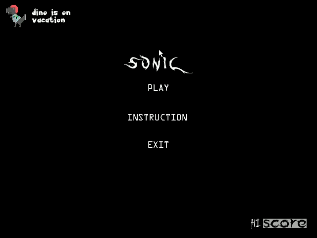

# COAL Project – MASM Game Implementation

This repository contains my **Computer Organization and Assembly Language (COAL)** project from Fall 2019.
The project was implemented in **MASM** and run using **DOSBox**. It is based on the course requirement to create a **menu-based side-scroller game** inspired by the offline Chrome T-Rex game.

The project makes heavy use of **pixel art sprites** stored in static arrays in memory and rendered using low-level VGA routines.

---

## Repository Layout

```
│── src/
│ ├── file.asm # Main MASM source code
│ ├── fileins.txt # Instructions text file
│ └── FILES.TXT # Game resource list
│
│── static/
│ ├── ArrayPixelArt.PNG
│ ├── ArrayPixelPrint.PNG
│ ├── PhotoshopCharacterPixelArt.PNG
│ ├── PhotoshopMainMenu.PNG
│ ├── ShrinkedvsNormalArray.PNG
│ ├── vgapalette.png
│ ├── demo_VP8.webm
│ └── COAL-Project2019.pdf
```

---

## Base Requirements Implemented

The project fulfilled all base requirements from the assignment:contentReference[oaicite:1]{index=1}:

- Menu-based navigation (**Play**, **Instructions**, **Exit**)
- Instructions loaded dynamically from a text file (`fileins.txt`)
- Game interface with multiple hurdles (aerial and terrestrial)
- Player movement in four directions: forward, backward, jump, bend
- Lives represented as heart sprites
- Display of top 3 highest scores with timestamp logging
- Randomly spawning hurdles and rare extra-life drops
- Level-up mechanism based on increasing score

---

## Project Highlights

### Pixel Art in Assembly

All 2D sprites and characters were stored as **static arrays** in assembly memory.

- [ArrayPixelArt.PNG](static/ArrayPixelArt.PNG) – shows pixel-level sprite definition.
- [ArrayPixelPrint.PNG](static/ArrayPixelPrint.PNG) – rendering output in assembly.

---

### VGA Palette Conversion

Since MASM supported only **16 VGA colors**, I converted colored images to fit this limited palette.
This was done using a mix of **Python scripts** and **Photoshop**, although the original Python code was lost.

- [vgapalette.png](static/vgapalette.png) – reference VGA palette used.

---

### Custom Fonts for Menus

I designed **custom pixel fonts** to display menu text like “PLAY”, “INSTRUCTION”, and “EXIT”.

- [PhotoshopCharacterPixelArt.PNG](static/PhotoshopCharacterPixelArt.PNG) – design of custom characters in pixel format.

---

### Photoshop-Aided Menu Layouts

Menu layouts were first designed in Photoshop and then mapped into the assembly coordinate system using the canvas grid as reference.

- [PhotoshopMainMenu.PNG](static/PhotoshopMainMenu.PNG) – final design reference.

---

### Memory Optimization via Bit Shifting (Major Highlight)

One of the biggest challenges was MASM’s **40 KB stack limit**.
Sprites and fonts quickly exceeded this limit since **each color value was stored in 1 byte**, even though only **4 bits (16 colors)** were actually needed.

**Solution:**

- I wrote a **C++ utility** to **bit-pack** sprite data, storing **two color values per byte**.
- On game execution, the data was **decompressed back** into full color arrays for rendering.
- This enabled me to include:
  - Full font set
  - 4 animated Sonic sprites
  - Bomb, Pokémon, Tank, Angry Bird, and Cloud sprites
- Result: **Less memory usage without losing quality**.

- [ShrinkedvsNormalArray.PNG](static/ShrinkedvsNormalArray.PNG) – comparison of normal vs compressed arrays. Notice how the optimized version is visibly denser (shrunk horizontally).

---

## 🎥 Demo

You can watch the demo video below:

[](static/demo_VP8.webm)
_(click to play, recorded on DOSBox at high clockspeed)_

**Note:** The jitter in sprites is due to the **scanline rendering method**. Each frame redraws the background before rendering the next sprite frame, which appears jumpy at higher DOSBox cycles.

---

## Tools & Environment

- **MASM615**
- **DOSBox** (recommended cycles ~650,000 for smoother gameplay)
- **Photoshop** for sprite/menu design
- **C++ utility** for sprite compression
- **Python (lost script)** for color palette conversion

---

## References

- [Project Requirements (COAL-Project2019.pdf)](static/COAL-Project2019.pdf)

---

## Authors

This was a **solo project** submitted as part of the **COAL course (Fall 2019)**.
All the designs and code was done by me.
